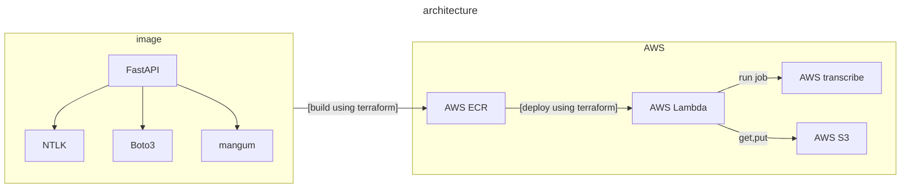

```mermaid
---
title: architecture 
---
flowchart LR
    subgraph AWSservices[AWS]
        AWSTranscribe[AWS transcribe]
        AWSS3[AWS S3] 
        AWSLambda[AWS Lambda]
        AWSECR[AWS ECR]
    end
    subgraph image
        FastAPI
        NTLK
        Boto3
        mangum
        FastAPI-->NTLK
        FastAPI-->Boto3
        FastAPI-->mangum
    end
    image--[build using terraform]-->AWSECR
    AWSECR--[deploy using terraform]-->AWSLambda
    AWSLambda--get,put-->AWSS3
    AWSLambda--run job-->AWSTranscribe
```
